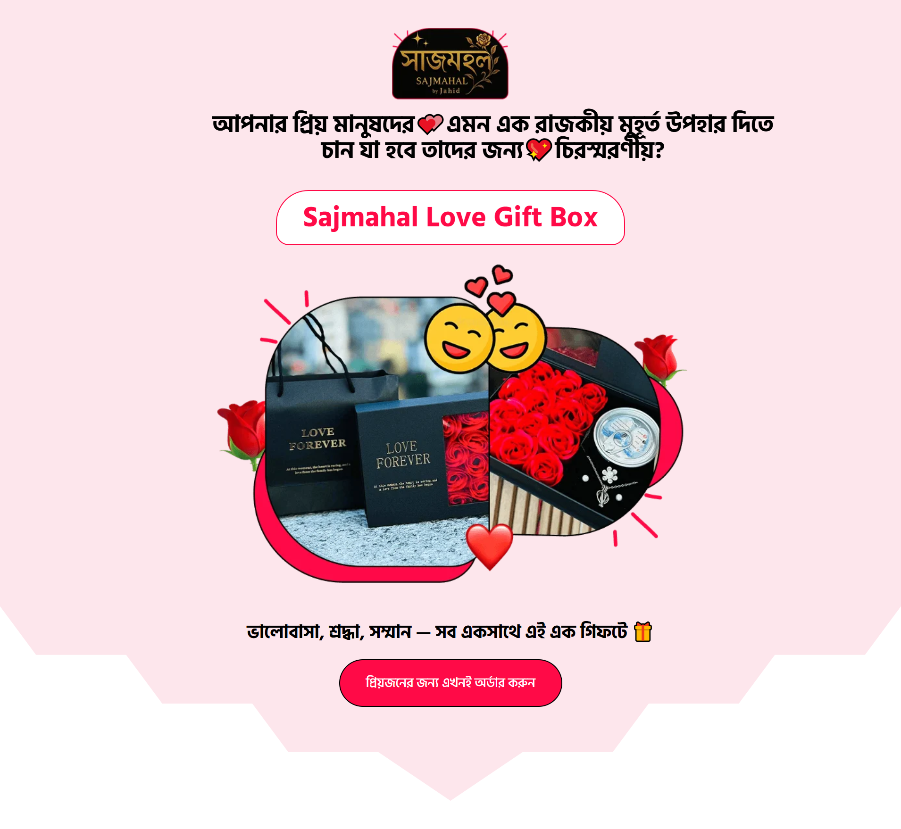
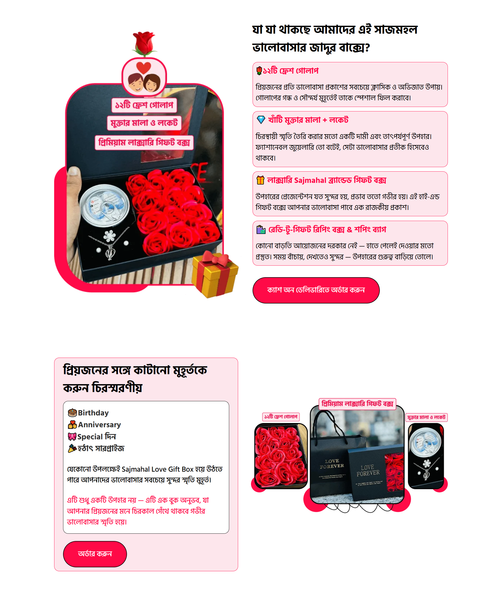
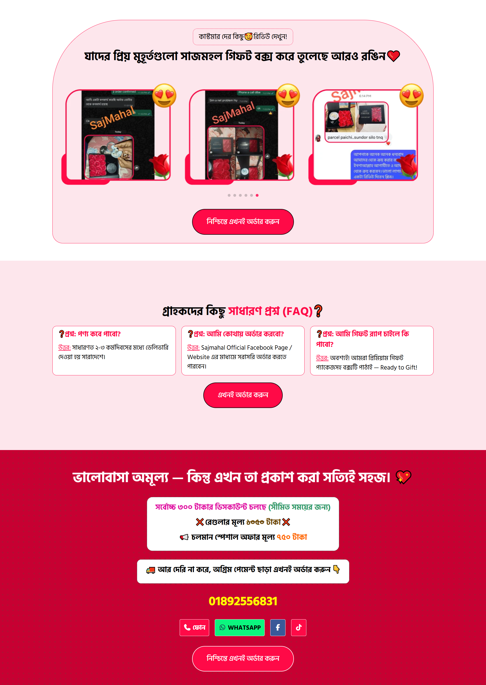
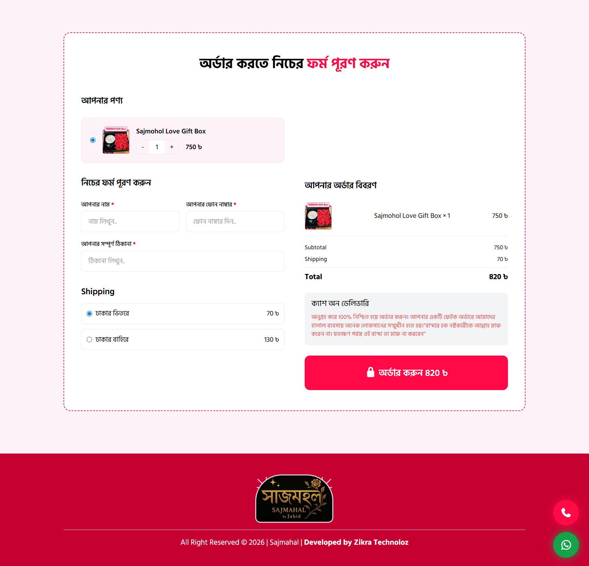

# Sajmahal – Product Landing Page

A modern and responsive **product landing page** built using **HTML, Tailwind CSS, and JavaScript**.  
This project showcases a promotional landing page for the **Sajmahal Love Gift Box**, designed to highlight product details, customer reviews, special offers, and a simple order interface.

The main goal of this project was to practice **conversion-focused landing page design**, responsive layouts, and interactive frontend components.

---

## 🌐 Live Demo

Live Website:  
https://sajmahal.netlify.app/

---

## ✨ Features

- Responsive landing page design
- Modern UI built with **Tailwind CSS**
- Product showcase section
- Customer review **image slider**
- FAQ section
- Pricing & promotional offer section
- Interactive **order summary calculation**
- Quantity and shipping cost updates using JavaScript
- Basic form validation
- Floating contact buttons (Phone & WhatsApp)

---

## 🛠️ Tech Stack

- **HTML5**
- **Tailwind CSS**
- **JavaScript**
- **Swiper.js** (for review slider)
- **Font Awesome** (icons)

---

## 📸 Screenshots

### Hero Section

### Product Details

### Customer Reviews

### Order Section

---

## 📱 Responsive Design

This landing page is fully responsive and optimized for:

- Desktop
- Tablet
- Mobile devices

Tailwind CSS utility classes were used to ensure a **mobile-first design approach**.

---

## 🎯 Project Purpose

This project was built to practice:

- Tailwind CSS layout design
- Responsive web design
- Frontend component structuring
- Landing page UX/UI principles
- Basic JavaScript interactivity

---

## 👨‍💻 Author

**Rudra Kaiser**

LinkedIn  
https://www.linkedin.com/in/rudrakaiser/